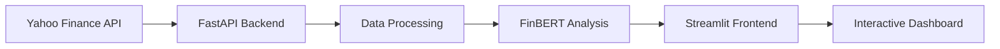

# FinBert: Financial Analysis Dashboard 📈

[](https://www.python.org/downloads/)
[](https://fastapi.tiangolo.com/)
[](https://streamlit.io/)
[](LICENSE)

A comprehensive financial analysis dashboard combining real-time market data, technical analysis, and NLP-powered sentiment analysis using FinBERT.


## 🚀 Features

- **Real-time Market Data Analysis**
  - Live stock price tracking
  - Historical data visualization
  - Volume analysis

- **Advanced Technical Analysis**
  - Moving Averages (20, 50 day)
  - RSI (Relative Strength Index)
  - MACD (Moving Average Convergence Divergence)
  - Bollinger Bands

- **Fundamental Analysis**
  - Company overview
  - Key financial metrics
  - Performance indicators
  - Risk metrics

- **NLP Sentiment Analysis**
  - FinBERT-powered sentiment analysis
  - Company description analysis
  - Sentiment visualization

- **Interactive Visualization**
  - Candlestick charts
  - Technical indicators
  - Sentiment graphs
  - Performance metrics

## 🛠️ Installation

1. Clone the repository:
```bash
git clone https://github.com/miladnasiri/FinBert.git
cd FinBert
```

2. Create and activate virtual environment:
```bash
python -m venv finbert_env
source finbert_env/bin/activate  # On Windows use: finbert_env\Scripts\activate
```

3. Install required packages:
```bash
pip install -r requirements.txt
```

## 🚦 Getting Started

1. Start the backend server:
```bash
uvicorn src.backend.main:app --reload
```

2. In a new terminal, start the frontend:
```bash
streamlit run src/frontend/app.py
```

3. Open your browser and navigate to:
- Frontend: http://localhost:8501
- API docs: http://localhost:8000/docs

## 🎯 Usage

1. Enter a stock symbol (e.g., AAPL, GOOGL)
2. Select analysis type:
   - Technical Analysis
   - Fundamental Analysis
   - Sentiment Analysis
3. Choose time period
4. Explore interactive visualizations and metrics

## 🏗️ Architecture



## 🔧 Technical Stack

- **Backend**
  - FastAPI
  - yfinance
  - pandas
  - numpy
  - ta (Technical Analysis)
  - transformers (FinBERT)

- **Frontend**
  - Streamlit
  - Plotly
  - pandas

- **ML/NLP**
  - FinBERT
  - PyTorch
  - transformers

## 📈 Sample Analysis

### Technical Analysis


### Fundamental Analysis


### Sentiment Analysis


## 🤝 Contributing

Contributions are welcome! Please feel free to submit a Pull Request.

1. Fork the repository
2. Create your feature branch (`git checkout -b feature/AmazingFeature`)
3. Commit your changes (`git commit -m 'Add some AmazingFeature'`)
4. Push to the branch (`git push origin feature/AmazingFeature`)
5. Open a Pull Request

## 📝 License

This project is licensed under the MIT License - see the [LICENSE](LICENSE) file for details.

## 🙏 Acknowledgments

- [FinBERT](https://huggingface.co/ProsusAI/finbert) for NLP model
- [yfinance](https://github.com/ranaroussi/yfinance) for market data
- [Streamlit](https://streamlit.io/) for the interactive dashboard
- [FastAPI](https://fastapi.tiangolo.com/) for the backend framework

## 📬 Contact

Milad Nasiri - [@miladnasiri](https://github.com/miladnasiri)

Project Link: [https://github.com/miladnasiri/FinBert](https://github.com/miladnasiri/FinBert)
